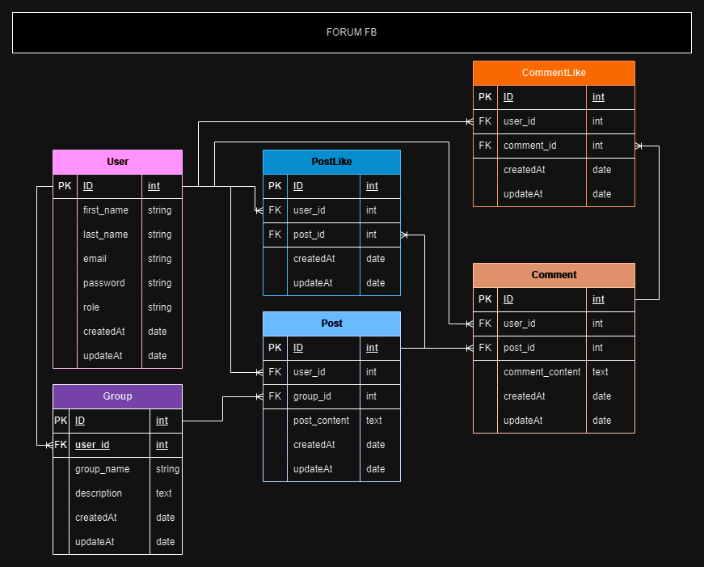

# Facebook Clone

## Kelompok 4

### Anggota Kelompok:

-   achmad hasan ardhian (@hasanardhian)
-   Bima Bakti Mandala (@BimaBaktiMandala)
-   Ferbiana Puspita Dewi (@bianaaa12)

### Deskripsi:

Projek ini adalah sebuah kloning dari platform media sosial Facebook. Tujuan dari proyek ini adalah untuk mengimplementasikan fitur-fitur dasar dari Facebook seperti membuat akun, membuat dan mengedit postingan, serta fitur-fitur lainnya.

### Teknologi yang Digunakan:

-   laravel 11/ui
-   mysql

### Cara Menjalankan Proyek:

1. Clone repositori ini ke dalam direktori lokal Anda.
2. Buka terminal dan arahkan ke direktori proyek.
3. Jalankan perintah `php artisan serve`.

### Gambaran Aplikasi:

### Link video & hosting

[video singkat](https://youtu.be/-cKLec6RM18)
[hosting app](https://fp-sanbercode-laravel-55-production.up.railway.app/)

### Kontribusi:

Jika Anda ingin berkontribusi pada proyek ini, silakan buat _pull request_ di repositori ini.

Terima kasih telah mengunjungi proyek kami!
